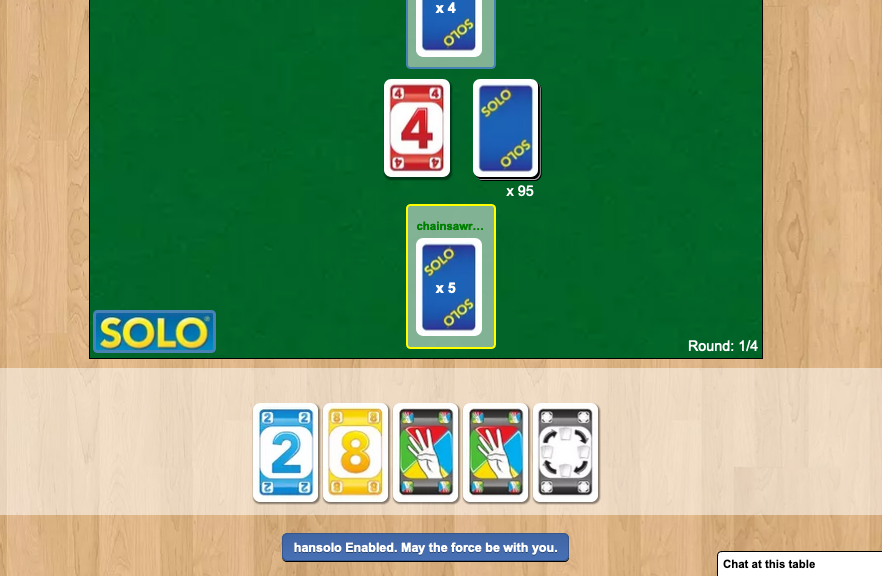

# hansolo

A userscript (aka greasemonkey) to enable keyboard shortcuts in the game Solo on BGA.

Keyboard shortcuts:

* Left shift - Solo
* Left Ctrl - close, confirm, pass, draw

You need to click the card or the "Play" button for the card you have just drawn.

When enabled, you'll see something like this:

# Installation

1. Install Tempermonkey (Firefox or Chrome) extension.

2. Click [this link](https://raw.githubusercontent.com/chainsawriot/hansolo/master/hansolo.user.js) to install the userscript.

